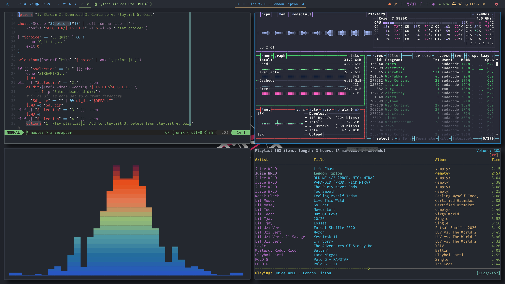
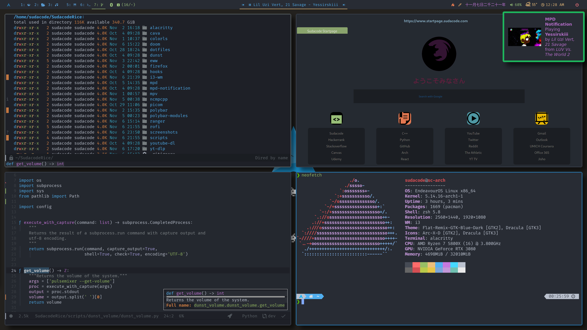

# Sudacode Rice

A collection of my Linux (Arch btw) configuration and dotfiles

## Screenshots

<b><i>Ordering:</b> Top Left -> Top Right -> Bottom Left -> Bottom Right</i>

vim, bpytop, cava, ncmpcpp

(firefox, doom emacs, doom emacs, neofetch)

## Current Setup

_Click the links to get quick access to the relevant code/files_

- Desktop Environment: [EndeavourOS](https://endeavouros.com/) (Arch btw)
- Window Manager: [i3-gaps](https://github.com/Airblader/i3)
  - [i3 config](i3-wm/config.desktop)
- Compositor: [ibhagwan's picom fork](https://github.com/ibhagwan/picom)
  - [picom config](picom/picom.conf)
- Notification Server: [dunst](https://github.com/dunst-project/dunst)
  - [dunst config](dunst/dunstrc)
- Terminal Emulator: [alacritty-ligatures](https://aur.archlinux.org/packages/alacritty-ligatures/)
  - [alacritty config](alacritty/alacritty.yml)
  - [colorscheme](alacritty/alacritty.onedark.yml)
- Text Editors: [vim](https://www.vim.org/) and [doom emacs](https://github.com/hlissner/doom-emacs)
  - [vimrc](dotfiles/.vimrc)
  - [doom config](doom)
- Audio Player: [mpd](https://www.musicpd.org/) with [ncmpcpp](https://github.com/ncmpcpp/ncmpcpp)
  - [mpd config](mpd/mpd.conf)
  - [ncmpcpp config](ncmpcpp/ncmpcpp.config)
- Audio Visualizer: [cava](https://github.com/karlstav/cava)
  - [cava config](cava/cavaconfig)
- System Monitor: [bpytop](https://github.com/aristocratos/bpytop)
- Firefox Startpage: [my startpage](https://github.com/ksyasuda/Firefox-Startpage)
