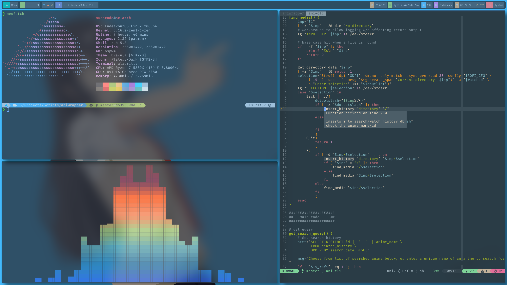
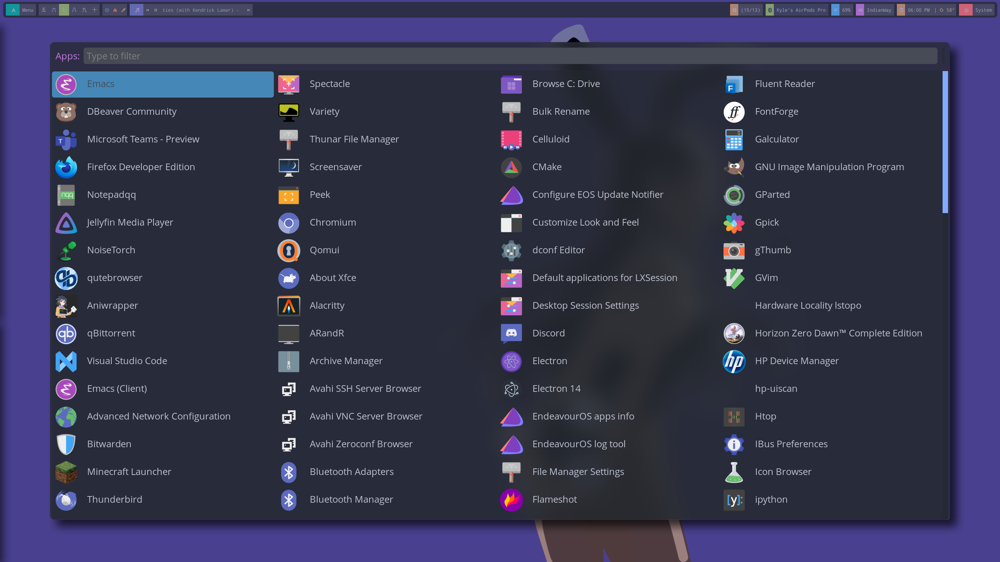

# Sudacode Rice

## My Linux (Arch btw) configuration and dotfiles

## Current Setup

_Click the links to get quick access to the relevant code/files_

- Desktop Environment: [EndeavourOS](https://endeavouros.com/) (Arch btw)
- Window Manager: [bspwm](https://github.com/baskerville/bspwm)
  - [bspwm config](bspwm/bspwmrc)
- Shell: [zsh (oh-my-zsh)](https://ohmyz.sh/)
  - [zshrc](dotfiles/.zshrc)
- Compositor: [ibhagwan's picom fork](https://github.com/ibhagwan/picom)
  - [picom config](picom/picom-hightransparency.conf)
- Notification Server: [dunst](https://github.com/dunst-project/dunst)
  - [dunst config](dunst/dunstrc)
- Status Bar: [polybar](https://github.com/polybar/polybar)
  - [polybar config](polybar-themes/sblocks/config.ini)
- Application Launcher: [rofi](https://github.com/davatorium/rofi)
  - [rofi config/colorscheme](rofi/config.rasi)
- Terminal Emulator: [alacritty-ligatures](https://aur.archlinux.org/packages/alacritty-ligatures/)
  - [alacritty config](alacritty/alacritty.yml)
  - [colorscheme](alacritty/doom_one.yml)
- Text Editor: [vim](https://www.vim.org/)
  - [vimrc](dotfiles/.vimrc)
- Audio Player: [mpd](https://www.musicpd.org/) with [ncmpcpp](https://github.com/ncmpcpp/ncmpcpp)
  - [mpd config](mpd/mpd.conf)
  - [ncmpcpp config](ncmpcpp/ncmpcpp.config)
- Audio Visualizer: [cava](https://github.com/karlstav/cava)
  - [cava config](cava/cavaconfig)
- System Monitor: [bpytop](https://github.com/aristocratos/bpytop)
